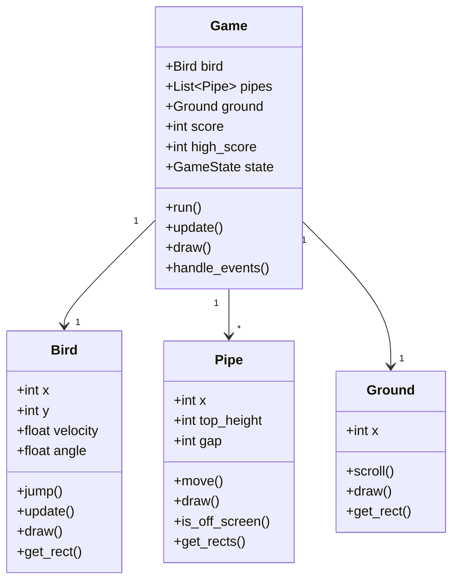

<div align="center">

# 🐦 Flappy Bird Clone
### Professional Python Game Development

[](https://www.python.org/downloads/)
[](https://www.pygame.org/)
[](LICENSE)
[](https://github.com/ankushkumar)
[](CONTRIBUTING.md)


*A feature-rich, professionally architected Flappy Bird game built with Python & Pygame*

[Features](#-features) • [Installation](#-installation) • [Gameplay](#-gameplay) • [Documentation](#-documentation) • [Contributing](#-contributing)

---

</div>

## 📋 Table of Contents

- [Overview](#-overview)
- [Features](#-features)
- [Tech Stack](#-tech-stack)
- [Installation](#-installation)
- [Usage](#-usage)
- [Gameplay](#-gameplay)
- [Architecture](#-architecture)
- [Configuration](#-configuration)
- [API Documentation](#-api-documentation)
- [Contributing](#-contributing)
- [Roadmap](#-roadmap)
- [License](#-license)
- [Author](#-author)

---

## 🎯 Overview

A production-ready recreation of the classic Flappy Bird game, implementing modern software engineering practices and design patterns. This project demonstrates proficiency in:

- Object-Oriented Programming (OOP)
- Game Development Fundamentals
- Physics Simulation
- State Management
- Asset Pipeline
- Performance Optimization

### 🎮 Key Highlights

```python
✨ Realistic Physics Engine    🎨 Smooth 60 FPS Rendering
🎯 Advanced Collision System   🔊 Multi-channel Audio
📊 Persistent High Scores      🎨 Modular Architecture
⚙️  Configurable Difficulty    📱 Cross-platform Support
```

---

## ✨ Features

### Core Mechanics

<details open>
<summary><b>🎮 Physics & Movement</b></summary>

- **Realistic Gravity Simulation** - Authentic falling mechanics with velocity acceleration
- **Smooth Jump Mechanics** - Responsive flap controls with configurable jump strength
- **Rotation Animation** - Dynamic bird rotation based on velocity
- **Momentum System** - Natural movement physics for immersive gameplay

</details>

<details>
<summary><b>🎨 Graphics & Animation</b></summary>

- **Multi-frame Bird Animation** - 3-frame wing-flapping cycle
- **Parallax Scrolling** - Multi-layer background for depth perception
- **Procedural Graphics** - Code-generated sprites with fallback to custom assets
- **Smooth Transitions** - Anti-aliased rendering at 60 FPS

</details>

<details>
<summary><b>🎯 Gameplay Systems</b></summary>

- **Dynamic Pipe Generation** - Randomized obstacles with configurable spacing
- **Real-time Scoring** - Live score tracking with visual feedback
- **High Score Persistence** - Automatic save/load system
- **Difficulty Scaling** - Progressive challenge based on player performance
- **Multiple Game States** - Start, Play, GameOver with transitions

</details>

<details>
<summary><b>🔊 Audio System</b></summary>

- **Multi-channel Sound FX** - Flap, score, collision, and game over sounds
- **Voice Feedback** - Optional TTS integration for accessibility
- **Audio Mixer** - Volume control and channel management

</details>

---

## 🛠️ Tech Stack

| Technology | Purpose | Version |
|-----------|---------|---------|
|  | Core Language | 3.7+ |
|  | Game Framework | 2.0+ |
|  | Physics Calculations | Optional |

### System Requirements

```yaml
Minimum:
  - Python: 3.7+
  - RAM: 256 MB
  - Display: 800x600
  - OS: Windows 7+ / macOS 10.12+ / Linux (any)

Recommended:
  - Python: 3.10+
  - RAM: 512 MB
  - Display: 1920x1080
  - OS: Windows 10+ / macOS 12+ / Ubuntu 20.04+
```

---

## 🚀 Installation

### Prerequisites

Ensure you have Python installed on your system:

```bash
# Check Python version
python --version  # or python3 --version

# Should output: Python 3.7.0 or higher
```

### Quick Start

#### Option 1: Clone Repository

```bash
# Clone the repository
git clone https://github.com/ankushkumar/flappy-bird-clone.git

# Navigate to project directory
cd flappy-bird-clone

# Install dependencies
pip install -r requirements.txt

# Run the game
python flappy_bird.py
```

#### Option 2: Direct Download

```bash
# Download ZIP from GitHub
# Extract to desired location
# Open terminal in extracted folder

# Install Pygame
pip install pygame

# Run game
python flappy_bird.py
```

### Platform-Specific Instructions

<details>
<summary><b>🪟 Windows</b></summary>

```powershell
# Install Python from python.org
# Open Command Prompt or PowerShell

# Install Pygame
pip install pygame

# Run game
python flappy_bird.py
```

</details>

<details>
<summary><b>🍎 macOS</b></summary>

```bash
# Install Homebrew (if not installed)
/bin/bash -c "$(curl -fsSL https://raw.githubusercontent.com/Homebrew/install/HEAD/install.sh)"

# Install Python
brew install python3

# Install Pygame
pip3 install pygame

# Run game
python3 flappy_bird.py
```

</details>

<details>
<summary><b>🐧 Linux</b></summary>

```bash
# Ubuntu/Debian
sudo apt-get update
sudo apt-get install python3 python3-pip
pip3 install pygame

# Fedora
sudo dnf install python3 python3-pip
pip3 install pygame

# Arch
sudo pacman -S python python-pip
pip install pygame

# Run game
python3 flappy_bird.py
```

</details>

---

## 🎮 Gameplay

### Controls

| Input | Action | Description |
|-------|--------|-------------|
| <kbd>SPACE</kbd> | Flap | Make the bird jump/fly upward |
| <kbd>LEFT CLICK</kbd> | Flap | Alternative jump control |
| <kbd>R</kbd> | Restart | Reset game after game over |
| <kbd>ESC</kbd> | Quit | Exit the game |
| <kbd>P</kbd> | Pause | Pause/Resume gameplay |

### Game Rules

```
🎯 OBJECTIVE
   Navigate the bird through pipe gaps to score points

⚠️ AVOID
   ❌ Hitting pipes (top or bottom)
   ❌ Touching the ground
   ❌ Flying above the ceiling

🏆 SCORING
   ✅ +1 point for each pipe successfully passed
   ✅ High score automatically saved
   ✅ Difficulty increases every 10 points
```

### Difficulty Progression

| Score Range | Speed Multiplier | Pipe Gap | Challenge |
|-------------|-----------------|----------|-----------|
| 0-9 | 1.0x | 150px | Beginner |
| 10-19 | 1.2x | 140px | Easy |
| 20-29 | 1.4x | 130px | Medium |
| 30-49 | 1.6x | 120px | Hard |
| 50+ | 1.8x | 110px | Expert |

### Pro Tips

> 💡 **Timing is Everything** - Tap in short bursts rather than holding
>
> 💡 **Stay Centered** - Aim for the middle of the pipe gap
>
> 💡 **Watch Momentum** - Anticipate the bird's falling speed
>
> 💡 **Practice Mode** - Start slow and focus on rhythm

---

## 🏗️ Architecture

### Project Structure

```
flappy-bird-clone/
│
├── 📄 flappy_bird.py           # Main game loop & entry point
├── 📄 README.md                # Project documentation
├── 📄 requirements.txt         # Python dependencies
├── 📄 LICENSE                  # MIT License
├── 📄 .gitignore              # Git ignore rules
│
├── 📁 src/                     # Source code modules
│   ├── __init__.py
│   ├── bird.py                # Bird class & physics
│   ├── pipe.py                # Pipe generation & movement
│   ├── ground.py              # Ground scrolling logic
│   ├── game_state.py          # State management
│   └── config.py              # Game configuration
│
├── 📁 assets/                  # Game assets
│   ├── images/                # Sprite files
│   │   ├── bird1.png          # Bird frame 1
│   │   ├── bird2.png          # Bird frame 2
│   │   ├── bird3.png          # Bird frame 3
│   │   ├── pipe.png           # Pipe sprite
│   │   ├── background.png     # Sky background
│   │   └── ground.png         # Ground tile
│   │
│   ├── sounds/                # Audio files
│   │   ├── flap.wav           # Jump sound
│   │   ├── score.wav          # Point sound
│   │   ├── hit.wav            # Collision sound
│   │   └── gameover.wav       # Game over sound
│   │
│   └── fonts/                 # Custom fonts
│       └── FlappyBird.ttf     # Game font
│
├── 📁 data/                    # Persistent data
│   └── high_score.txt         # Saved high score
│
├── 📁 tests/                   # Unit tests
│   ├── __init__.py
│   ├── test_bird.py
│   ├── test_pipe.py
│   └── test_collision.py
│
└── 📁 docs/                    # Additional documentation
    ├── API.md                 # API documentation
    ├── CONTRIBUTING.md        # Contribution guidelines
    └── CHANGELOG.md           # Version history
```

### Class Diagram



### Design Patterns Used

- **Singleton Pattern** - Game state management
- **Factory Pattern** - Pipe generation
- **Observer Pattern** - Score updates
- **State Pattern** - Game state transitions

---

## ⚙️ Configuration

### Game Settings

Edit `src/config.py` to customize game parameters:

```python
# Display Settings
SCREEN_WIDTH = 400
SCREEN_HEIGHT = 600
FPS = 60

# Physics Settings
GRAVITY = 0.5              # Falling acceleration
JUMP_STRENGTH = -10        # Upward force on flap
TERMINAL_VELOCITY = 15     # Maximum fall speed

# Game Difficulty
PIPE_SPEED = 3            # Horizontal pipe movement
PIPE_GAP = 150            # Vertical gap between pipes
PIPE_FREQUENCY = 1500     # Milliseconds between pipes
MIN_PIPE_HEIGHT = 50      # Minimum pipe height
MAX_PIPE_HEIGHT = 400     # Maximum pipe height

# Visual Settings
BIRD_ANIMATION_SPEED = 100  # Frame delay (ms)
GROUND_SCROLL_SPEED = 3     # Ground movement speed

# Colors (RGB)
SKY_BLUE = (135, 206, 235)
PIPE_GREEN = (0, 200, 0)
BIRD_YELLOW = (255, 255, 0)
GROUND_BROWN = (139, 69, 19)

# Audio Settings
SOUND_ENABLED = True
MUSIC_VOLUME = 0.7
SFX_VOLUME = 0.8
```

### Custom Assets

Replace default procedural graphics with custom sprites:

**Image Specifications:**

| Asset | Dimensions | Format | Notes |
|-------|-----------|--------|-------|
| `bird1.png` | 34x24 px | PNG-24 | Frame 1 (wings up) |
| `bird2.png` | 34x24 px | PNG-24 | Frame 2 (neutral) |
| `bird3.png` | 34x24 px | PNG-24 | Frame 3 (wings down) |
| `pipe.png` | 52x320 px | PNG-24 | Green pipe texture |
| `background.png` | 288x512 px | PNG-24 | Sky background |
| `ground.png` | 336x112 px | PNG-24 | Ground tile |

**Audio Specifications:**

| Sound | Format | Duration | Sample Rate |
|-------|--------|----------|-------------|
| `flap.wav` | WAV | 0.1s | 44.1 kHz |
| `score.wav` | WAV | 0.2s | 44.1 kHz |
| `hit.wav` | WAV | 0.3s | 44.1 kHz |
| `gameover.wav` | WAV | 0.5s | 44.1 kHz |

---

## 📚 API Documentation

### Bird Class

```python
class Bird:
    """
    Represents the player-controlled bird character.
    
    Attributes:
        x (int): Horizontal position (constant)
        y (float): Vertical position (variable)
        velocity (float): Current vertical velocity
        angle (float): Current rotation angle
        
    Methods:
        jump(): Apply upward force
        update(): Update position and rotation
        draw(screen): Render bird to screen
        get_rect(): Get collision rectangle
    """
    
    def __init__(self, x, y):
        """Initialize bird at starting position."""
        
    def jump(self):
        """Apply upward velocity for flapping."""
        
    def update(self):
        """Update bird physics and animation."""
        
    def draw(self, screen):
        """Render bird sprite with rotation."""
        
    def get_rect(self):
        """Return pygame.Rect for collision detection."""
```

### Pipe Class

```python
class Pipe:
    """
    Represents an obstacle pipe pair.
    
    Attributes:
        x (int): Horizontal position
        gap (int): Vertical gap between pipes
        top_height (int): Height of top pipe
        passed (bool): Whether bird passed this pipe
        
    Methods:
        move(): Update horizontal position
        draw(screen): Render pipes
        is_off_screen(): Check if pipe left screen
        get_rects(): Get collision rectangles
    """
```

---

## 🤝 Contributing

We welcome contributions from the community! Here's how you can help:

### Getting Started

1. **Fork** the repository
2. **Clone** your fork locally
3. **Create** a feature branch (`git checkout -b feature/AmazingFeature`)
4. **Commit** your changes (`git commit -m 'Add some AmazingFeature'`)
5. **Push** to the branch (`git push origin feature/AmazingFeature`)
6. **Open** a Pull Request

### Development Setup

```bash
# Clone your fork
git clone https://github.com/YOUR_USERNAME/flappy-bird-clone.git

# Add upstream remote
git remote add upstream https://github.com/ankushkumar/flappy-bird-clone.git

# Install development dependencies
pip install -r requirements-dev.txt

# Run tests
pytest tests/

# Run linter
pylint src/
```

### Code Standards

- Follow [PEP 8](https://pep8.org/) style guide
- Write docstrings for all classes and functions
- Add unit tests for new features
- Keep commits atomic and descriptive
- Update documentation as needed

### Areas for Contribution

- 🐛 Bug fixes
- ✨ New features
- 📝 Documentation improvements
- 🎨 Graphics and audio assets
- 🧪 Additional test coverage
- 🌍 Translations and localization

---

## 🗺️ Roadmap

### Version 1.0 (Current)
- ✅ Core gameplay mechanics
- ✅ Basic graphics and audio
- ✅ High score persistence
- ✅ Cross-platform support

### Version 2.0 (Planned)
- [ ] Multiple bird skins/characters
- [ ] Power-ups (shields, slow motion, magnets)
- [ ] Day/night cycle themes
- [ ] Achievement system
- [ ] Cloud save integration

### Version 3.0 (Future)
- [ ] Multiplayer mode (local & online)
- [ ] Level editor
- [ ] Custom obstacle types
- [ ] Mobile port (iOS/Android)
- [ ] Global leaderboards
- [ ] Replay system

### Community Requests
- [ ] Gamepad/controller support
- [ ] Accessibility features (colorblind mode)
- [ ] Practice mode with checkpoints
- [ ] Statistics dashboard

---

## 📄 License

This project is licensed under the **MIT License** - see the [LICENSE](LICENSE) file for details.

```
MIT License

Copyright (c) 2024 Ankush Kumar

Permission is hereby granted, free of charge, to any person obtaining a copy
of this software and associated documentation files (the "Software"), to deal
in the Software without restriction, including without limitation the rights
to use, copy, modify, merge, publish, distribute, sublicense, and/or sell
copies of the Software, and to permit persons to whom the Software is
furnished to do so, subject to the following conditions:

The above copyright notice and this permission notice shall be included in all
copies or substantial portions of the Software.
```

---

## 👨‍💻 Author

<div align="center">

### **Ankush Kumar**

[](https://github.com/ankushkumarake1234-lang)
[](https://www.linkedin.com/in/ankush-kumar-60333537b/)
[](https://x.com/AnkushKuma42443)
[](https://profound-muffin-4b3660.netlify.app/)

**Python Developer | Game Enthusiast | Open Source Contributor**

</div>

---

## 🙏 Acknowledgments

- **Original Flappy Bird** - Created by Dong Nguyen
- **Pygame Community** - For excellent documentation and support
- **Asset Contributors** - Free graphics and audio resources
- **Beta Testers** - For valuable feedback and bug reports

---

## 📞 Support

Having issues? We're here to help!

- 📧 **Email:** ankushkumarake1234@gmail.com

---

## 📊 Project Stats

<div align="center">


</div>

---

<div align="center">

### ⭐ If you found this project helpful, please give it a star!

**Made with ❤️ and Python by [Ankush Kumar](https://github.com/ankushkumar)**

*Happy Gaming! 🎮🐦*

</div>
